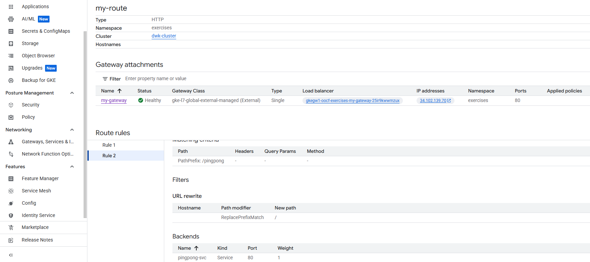

[](3.4.png)

make sure you have `exercises` namespace

1. go to both folders and command(log-output in root and ping-pong/pingpong)

```kubectl apply -f manifests -n exercises```

2. then appply the yaml files on networking folder:
 ```kubectl apply -f networking -n exercises```

3. then Get the external IP from the gateway:
```kubectl get gateway -n exercises```

4. Log Output app: `http://<ADDRESS>/`
Pingpong app: `http://<ADDRESS>/pingpong`
