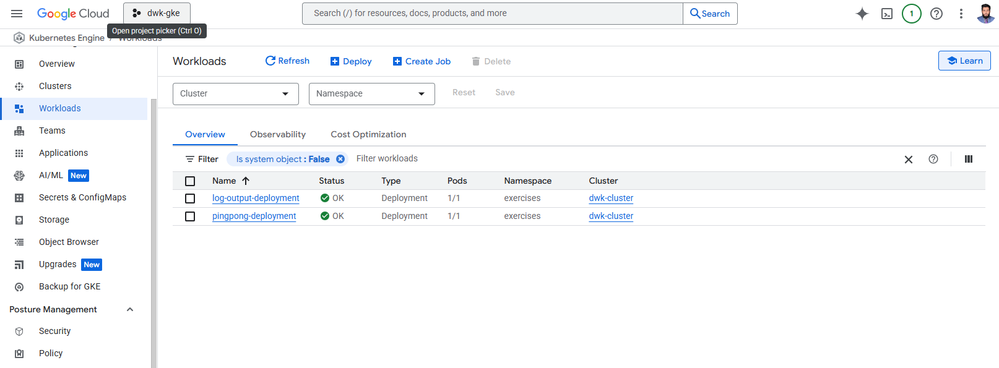

[](3.2.png)

make sure you have `exercises` namespace

1. go to both folders and command(log-output in root and pingpong)

```kubectl apply -f manifests -n exercises```

2. then Get the external IP of the ingress:
```kubectl get ingress -n exercises```

3. Log Output: http://<Ingress-EXTERNAL-IP>/

   Ping-Pong: http://<Ingress-EXTERNAL-IP>/pingpong
