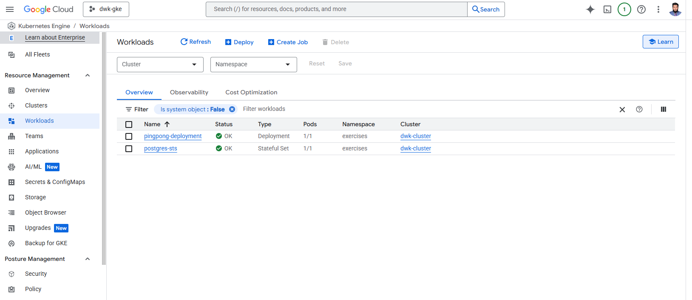

[](3.1.png)

1. go to both folders and command

```kubectl apply -f manifests -n exercises```

2. then Get the external IP of the LoadBalancer service:
```kubectl get svc -n exercises```

3. visit:```http://<EXTERNAL-IP>:3001/pingpong```
