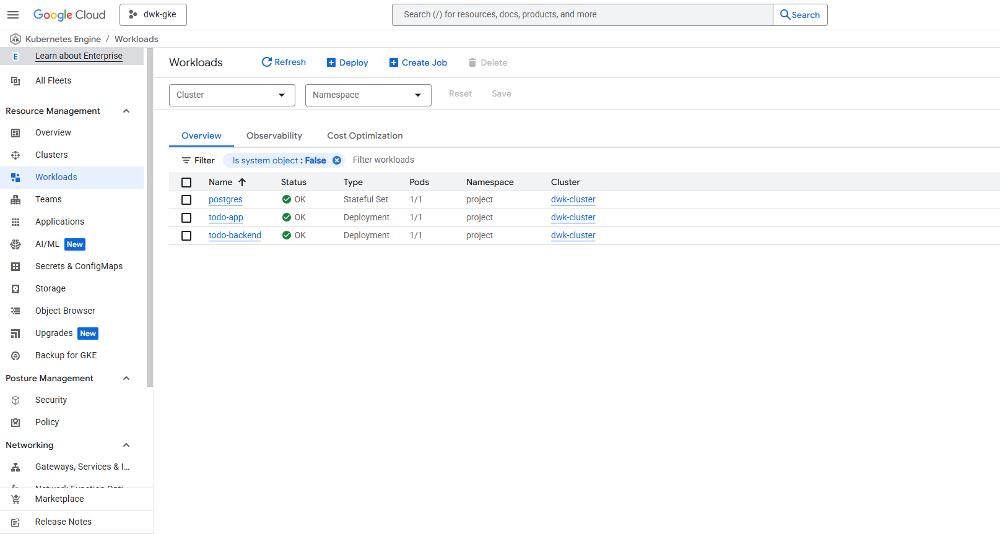

Img to check monitoring worked perfectly:

[](3.5.png)


Instructions:
1.Go to both frontend and backend, then ```kubectl apply -k ./manifests -n project```

2.then from ingress get the  IP:```kubectl get ingress -n project```

3.You can now visit:

Frontend: `http://<INGRESS-IP>/`

