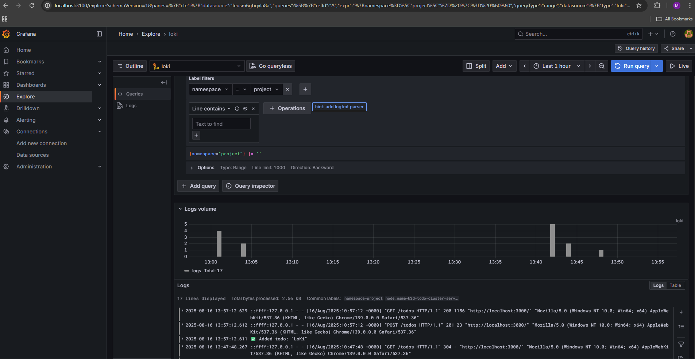

Img to check monitoring worked perfectly:

[](Graffana.png)


Instructions:


```kubectl apply -f backend/manifests```

```kubectl apply -f frontend/manifests```

```kubectl apply -f cron/cronjob.yaml```

then use port forward to connect:

```kubectl port-forward svc/todo-service 3000:3000 -n project```

```kubectl port-forward svc/todo-backend-service 3002:3002 -n project```


You can now visit:

Frontend: ```http://localhost:3000```

Backend API: ```http://localhost:3002```


then Install monitoring stack if not available(loki,promtail,graffana)

```
helm repo add grafana https://grafana.github.io/helm-charts
helm install loki grafana/loki-stack -n loki-stack --create-namespace
helm install kube-prometheus grafana/kube-prometheus-stack -n prometheus --create-namespace
```
Access Graffana:

```kubectl port-forward -n prometheus svc/kube-prometheus-stack-1755006958-grafana 3100:80```

visit:```http://localhost:3100```

Go to Grafana → Explore → Select Loki datasource(create manually if
 needed URL:`http://loki.loki-stack:3100`)

select `{namespace="project"}` and Run  Query
